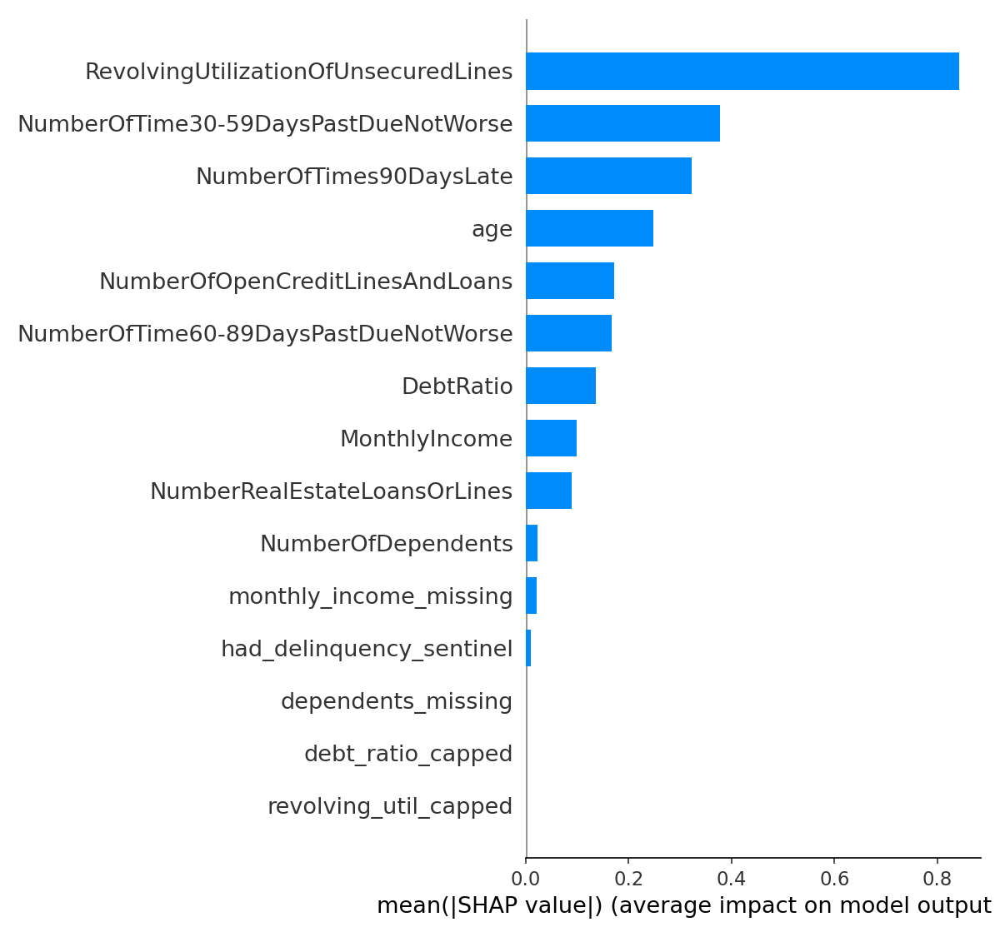
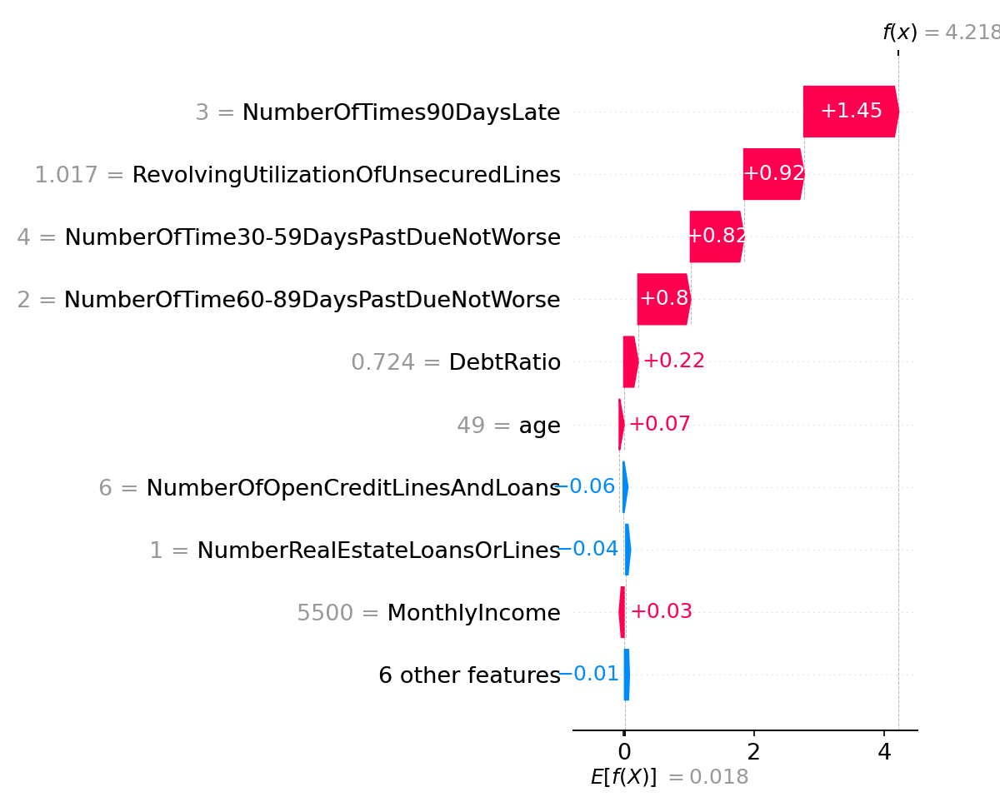

**Contact:** [LinkedIn](https://www.linkedin.com/in/ogbonnaya-nzie-ezichi-msc-065687a6/) · [GitHub](https://github.com/sunnystats3n) · [Google Scholar](https://scholar.google.ca/citations?user=80PLXMkAAAAJ&hl=en)

\newpage

# Scope and disclaimer

This document is an **illustrative application of OSFI Guideline E-23** (Model Risk Management, effective May 1, 2027) principles to a public dataset, built as a portfolio demonstration of data governance and model risk management documentation skills. It is **not**:

- A claim of regulatory compliance for any real federally regulated financial institution (FRFI).
- A real credit model connected to any live decision system.
- A substitute for legal, compliance, or fair-lending review — the bias/fairness section in particular is a screening-level analysis, not a legal determination.
- An endorsement or accusation regarding any specific institution's practices.

Every governance decision documented here (data cleaning choices, risk tiering, thresholds, monitoring triggers) is a **judgment call made for demonstration purposes**, stated explicitly so a reader can evaluate the reasoning rather than take the conclusions on faith.

**Data source:** Kaggle "Give Me Some Credit," a public, anonymized dataset with no real applicant identities.
**Guideline reference:** OSFI Guideline E-23 – Model Risk Management (2027), osfi-bsif.gc.ca.

\newpage

# 1. Why this project

OSFI's revised Guideline E-23 (finalized 2025, effective May 1, 2027) is the first Canadian federal supervisory guideline to explicitly fold AI/ML models into model risk management requirements — explainability, bias, and "black box" transparency are now named requirements, not implied ones. It applies to all federally regulated banks, insurers, and trust companies, proportional to institution size, strategy, risk profile, and complexity. Federally regulated institutions are actively building compliance programs ahead of the 2027 deadline.

Rather than write about E-23 in the abstract, this project builds the artifact a model risk management function would actually have to produce: a real model, on real (if public) data, governed end-to-end against the guideline's own structure — model inventory, risk tiering, independent validation, ongoing monitoring, and governance roles.

**The setup:** Kaggle's "Give Me Some Credit" dataset (150,000 retail credit records; target = serious delinquency, 90+ days past due or worse, within 2 years). Two competing models were built on identical features and an identical train/validation/test split (60/20/20, stratified, `random_state=42`):

- **Logistic regression** — the "traditional" model: fully transparent, coefficients are the explanation.
- **XGBoost** — the "AI/ML" model E-23's 2025 update specifically targets: stronger performance, but opaque without additional tooling.

Building both on identical data and splits was a deliberate governance choice: it is the only way to attribute any behavioral difference between the two models to the model class itself, rather than to inconsistent data handling.

\newpage

# 2. Data quality findings (the most governance-relevant part of this project)

Before any model was touched, this dataset required six documented judgment calls:

1. **609 exact duplicate rows** removed — an extraction-quality issue, not a modeling choice.
2. **1 record with age = 0** removed (impossible value); **13 records with age > 100** kept but flagged for ongoing monitoring, since deleting rare-but-plausible elderly applicants would itself introduce a selection bias.
3. **225 records** carried sentinel values (96 or 98) in the three delinquency-count fields — a well-known defect in this dataset, almost certainly a placeholder/error code rather than a true count. Recoded to the column median with a `had_delinquency_sentinel` flag retained.
4. **747 records** had an implausibly large revolving-utilization ratio (up to 50,708 against a ratio that should rarely exceed ~1.5), and **747 records** had extreme debt-ratio values (up to 329,664) — both winsorized at the 99.5th percentile with capped-value flags retained.
5. **Monthly income missing for 29,221 records (19.5% of the cleaned dataset)** — imputed by age-decile median with a `monthly_income_missing` flag retained, since non-disclosure of income is itself a potentially informative — and potentially bias-relevant — signal.
6. **Number of dependents missing for 3,828 records (2.6%)** — imputed with the mode, flag retained.

None of these are edge-case rounding issues — nearly a fifth of the applicant population had no reported income, and the sentinel-value issue affects records that, taken at face value, would look like extreme outliers with disproportionate influence on any model that doesn't handle them explicitly.

**Why this is the most important section of the project, not a preamble to it:** a validator handed this dataset with these six decisions made silently would have no way to know they'd been made at all. OSFI E-23's validation and documentation requirements exist largely to catch exactly this failure mode. A polished model with an undocumented data-cleaning pipeline underneath it is not a validated model — it's a black box wearing a scorecard's clothing.

\newpage

# 3. Model Inventory Entry

*Maps to E-23's "Model Inventory" requirement: a comprehensive, continuously updated record of all models carrying non-negligible risk.*

| Field | Value |
|---|---|
| Model name | Retail Unsecured Credit — 2-Year Serious Delinquency PD Model |
| Business purpose | Estimate probability of serious delinquency within 2 years, to support underwriting and portfolio monitoring |
| Model type | Two candidates: logistic regression scorecard; gradient-boosted trees (XGBoost) |
| Input data | 10 raw applicant attributes + 5 derived data-quality flags |
| Output | Probability of serious delinquency in 24 months (0-1) |
| Materiality | High (illustrative) — a retail underwriting PD model directly gates credit access |
| Third-party dependency | None — open-source tooling only |
| Status | Illustrative / not deployed |

E-23 requires *every* model carrying non-negligible risk to be inventoried, including ones still under evaluation — both candidate models are carried as linked inventory entries, mirroring the real decision an institution faces before choosing one for deployment.

\newpage

# 4. Risk Tiering Rationale

*Maps to E-23's "Risk Rating & Assessment": inherent model risk assessed via quantitative factors (portfolio size, financial impact) and qualitative factors (business purpose, complexity, data reliability, customer impact).*

| Factor | Assessment |
|---|---|
| Portfolio scale | 149,390 records post-cleaning |
| Financial impact | High — underwriting decline/approval directly affects customers |
| Event rate | 6.70% — moderate class imbalance affecting calibration and validation design |
| Model complexity | Logistic (low) vs. XGBoost, 500 rounds/depth 4 (moderate-high, requires post-hoc explainability tooling) |
| Data reliability | Moderate-high — see Section 2 |
| Third-party dependency | None — lowers inherent risk relative to a vendor "black box" |

**Risk tier recommendation:**

- **Logistic regression — Tier 2.** High business/customer impact, but low complexity and fully transparent coefficients.
- **XGBoost — Tier 3.** Same business/customer impact, plus elevated complexity, dependency on post-hoc explainability tooling, and a comparable-or-larger disparate-impact signal across age bands (Section 6).

A Tier 3 rating is not a rejection of the AI/ML model — it is a statement that its validation, explainability documentation, and monitoring obligations must be proportionally more rigorous, given the modest performance lift it delivers (Section 5). That trade-off is exactly what E-23 is designed to force into the open rather than leave to a developer's default choice of algorithm.

\newpage

# 5. Independent Validation Report

*Maps to E-23's "Validation & Review": independent review of conceptual soundness, appropriateness, limitations, and performance.*

## 5.1 Conceptual soundness

Logistic regression coefficients are directionally sensible and stable across train/val/test splits. XGBoost's gain-based feature importance is directionally consistent with the logistic coefficients — two structurally different models agreeing on risk drivers is a basic soundness check that both pass. Shared limitation: neither model includes macroeconomic or vintage variables, and neither has been through-the-cycle tested.

## 5.2 Performance (test set, n = 29,878, event rate 6.70%)

| Metric | Logistic | XGBoost | Delta |
|---|---|---|---|
| AUC-ROC | 0.8527 | 0.8616 | +0.0089 |
| Gini coefficient | 0.7054 | 0.7232 | +0.0178 |
| KS statistic | 0.5554 | 0.5750 | +0.0196 |
| Brier score (lower better) | 0.1468 | 0.1435 | -0.0033 |
| Precision @ 0.5 | 21.5% | 21.0% | -0.5 pp |
| Recall @ 0.5 | 74.7% | 78.2% | +3.5 pp |

Train/validation/test AUC were within 1.3 points of each other for both models — neither shows material overfitting.

**Validator's read:** XGBoost's lift is real but modest — about one Gini point, two points of KS, and roughly 3.5 additional points of recall, at the cost of slightly lower precision. Whether that lift justifies a Tier 3 governance burden instead of Tier 2 is a business decision this report surfaces but does not make.

## 5.3 Explainability (AI/ML-specific)

{width=85%}

SHAP analysis confirms the XGBoost model is explainable at both the global level (above) and the individual-decision level (Figure 2, next page) — a single high-risk applicant's prediction decomposed feature-by-feature, the kind of explanation an adverse-action process would need to produce.

This does **not** eliminate the governance cost difference from the logistic model: the logistic coefficients *are* the explanation, at zero additional tooling cost. XGBoost's explanation is a derived artifact of a separate library (SHAP) with its own assumptions (background sample, Tree SHAP approximation) that would itself need validation sign-off in a real deployment. This asymmetry — not whether XGBoost *can* be explained, but what it costs to keep it explainable — is the point E-23 makes by singling out AI/ML models for extra scrutiny.

\newpage

{width=85%}

## 5.4 Bias / fairness screening

See Section 6. Headline finding: both models trip a four-fifths-rule screen on age-based decline rates. This requires a fair-lending/legal review before any real deployment decision — it is not resolved by this validation report.

## 5.5 Overall recommendation

- **Logistic regression:** passes validation for the stated use case, with the age-disparity finding carried forward as a required legal/compliance follow-up.
- **XGBoost:** conditional pass — adequate performance and explainability, but deployment should not proceed without a documented business case for the incremental lift, and the same fair-lending review as the logistic model.

\newpage

# 6. Bias / Fairness Screening

**Why age:** this dataset carries no gender, ethnicity, or other demographic field, so age is the only available proxy for a ground protected under Canadian human-rights legislation. Age is also one of the strongest raw predictors in both models — precisely the scenario E-23's AI/ML bias requirement targets: a feature can be statistically predictive and legally/ethically fraught at the same time, and a governance framework has to make that tension visible rather than resolve it silently inside the model.

## Logistic regression — outcomes by age band

| Age band | n | Actual event rate | Decline rate | False positive rate | Disparate impact ratio (vs. 45-59) |
|---|---|---|---|---|---|
| Under 30 | 1,759 | 11.94% | 48.04% | 42.61% | 2.090 |
| 30-44 | 7,785 | 9.74% | 35.92% | 30.90% | 1.562 |
| 45-59 (reference) | 10,756 | 6.64% | 22.99% | 19.64% | 1.000 |
| 60+ | 9,578 | 3.34% | 8.90% | 7.22% | 0.387 |

## XGBoost — outcomes by age band

| Age band | n | Actual event rate | Decline rate | False positive rate | Disparate impact ratio (vs. 45-59) |
|---|---|---|---|---|---|
| Under 30 | 1,759 | 11.94% | 49.86% | 44.29% | 1.952 |
| 30-44 | 7,785 | 9.74% | 37.96% | 32.93% | 1.486 |
| 45-59 (reference) | 10,756 | 6.64% | 25.54% | 22.01% | 1.000 |
| 60+ | 9,578 | 3.34% | 9.15% | 7.34% | 0.358 |

**Screening summary:** minimum disparate-impact ratio 0.387 (logistic) and 0.358 (XGBoost) against the conventional four-fifths (0.80) screening threshold — both models flag.

**Reading this honestly:** part of the gap tracks a genuine underlying risk gradient (actual default rates fall from 11.9% under-30 to 3.3% for 60+) — but a screening tool doesn't distinguish "the model reflects real risk" from "the model launders a legally protected characteristic into a decision," and this report doesn't resolve that distinction on its own either. That determination requires a fair-lending/legal review with access to information (legal standards, institutional risk appetite, potentially additional demographic data) this project does not have. What this analysis *does* establish is that the question is live for both models, and marginally more pronounced for XGBoost on several age bands — which is itself the finding a Tier 3 model risk process is supposed to surface before deployment, not after a regulator asks.

\newpage

# 7. Ongoing Monitoring & Drift Plan

*Maps to E-23's "Monitoring": defined thresholds, contingency plans, and escalation procedures.*

| Metric | Cadence | Green | Amber | Red |
|---|---|---|---|---|
| AUC-ROC (rolling 3-month) | Monthly | ≥0.84 | 0.80-0.84 | <0.80 |
| Population Stability Index | Monthly | <0.10 | 0.10-0.25 | ≥0.25 |
| Characteristic Stability Index | Quarterly | <0.10 | 0.10-0.25 | ≥0.25 |
| Calibration (observed vs. predicted) | Quarterly | ±10% | ±10-25% | >±25% |
| Income missingness rate | Monthly | ±5pp of 19.5% baseline | ±5-10pp | >±10pp |
| Sentinel-flag rate | Monthly | ±2pp of 0.25% baseline | 2-5pp | >5pp |
| Age-band disparate impact ratio | Quarterly | ≥0.80 | 0.65-0.80 | <0.65 |

The sentinel-flag rate is monitored as a **data-quality** trigger, not a model-performance trigger — a sudden change is far more likely to signal an upstream pipeline or codebook change than genuine behavioral drift, and should route to the data owner first. The disparate-impact ratio is monitored continuously, not only at initial validation, because a model that clears a fairness screen today can drift into a flagged state as the applicant population changes — E-23 treats this as an ongoing obligation, not a one-time filing.

**Escalation:** Amber → model owner investigates within 10 business days. Red on performance/calibration → independent validation notified within 2 business days, model use paused pending re-validation. Red on disparate-impact ratio → escalates directly to compliance/legal in parallel, regardless of performance status.

\newpage

# 8. Governance Roles (RACI)

*Maps to E-23's "Governance & Organization": clear roles for owners, developers, reviewers, approvers, and users.*

| Activity | Model Owner | Developer | Independent Validator | Compliance/Legal | Risk Committee |
|---|---|---|---|---|---|
| Business purpose definition | A | C | I | C | I |
| Model development | I | R/A | I | I | I |
| Data lineage sign-off | C | R | A | I | I |
| Risk tiering | C | C | R/A | C | I |
| Independent validation | I | C | R/A | I | I |
| Explainability approval | I | C | R/A | C | I |
| Bias/fair-lending review | I | I | C | R/A | I |
| Go-live approval | A | I | C | C | R |
| Ongoing monitoring | R | C | I | I | I |
| Red-trigger escalation | R | C | A | R (bias) | I |

**Why this matters for a solo project:** no real model risk management framework lets one person fill every role in this table — the value comes precisely from the developer not validating their own work, and compliance signing off on fairness independent of performance. This table exists to show that understanding, not to imply the separation happened here.

\newpage

# 9. What this demonstrates

This project is not a claim that one person can run model risk management for a federally regulated institution — Section 8 exists specifically to show the opposite. What it demonstrates is the ability to read a supervisory guideline, translate its structure into the actual documents an institution would need to produce, and back every claim in those documents with a reproducible analysis rather than boilerplate: every number in this report traces to a script and an output file, every governance judgment call is stated rather than buried, and every finding that exceeds this project's scope — the fair-lending determination chief among them — is named as such rather than quietly resolved.

Full code, data-cleaning scripts, and governance documents: [github.com/sunnystats3n](https://github.com/sunnystats3n) (repository link to be added on publication).
